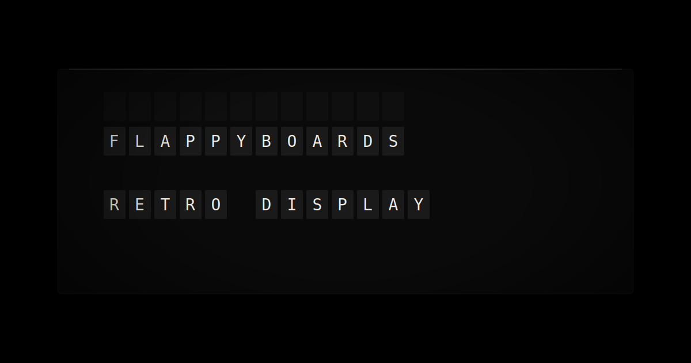

<p align="center">
  
</p>

<h1 align="center">FlappyBoards</h1>

<p align="center">
  Turn any TV into a retro split-flap display.<br/>
  <sub>3D animations · synced audio · dark/light mode · open source</sub>
</p>

<p align="center">
  <a href="https://flappyboards.vercel.app"><strong>Live Demo</strong></a> · <a href="https://flappyboards.vercel.app/display"><strong>Launch Display</strong></a>
</p>

---

## What it does

FlappyBoards renders a 6x22 grid of split-flap tiles that animate with realistic CSS 3D transforms. Each tile cycles sequentially through the full character set — just like a real mechanical display — with staggered timing, physics-based easing, and synchronized clack sounds.

- 30+ curated quotes that auto-rotate on a configurable timer
- Dark and light theme with monochromatic aesthetic
- Settings panel for flip speed, stagger delay, rotation interval, volume
- Custom text input — type any message and send it to the display
- Weather API integration ready (OpenWeatherMap)
- PWA-installable for always-on TV mode
- Responsive scaling from mobile to 4K

## Quick start

```bash
git clone https://github.com/vxcozy/flappyboards.git
cd flappyboards
npm install
npm run dev
```

Open [http://localhost:3000](http://localhost:3000) for the landing page, or [http://localhost:3000/display](http://localhost:3000/display) for the full-screen display.

## Documentation

Documentation follows the [Diataxis](https://diataxis.fr) framework:

| | Learning-oriented | Task-oriented |
|---|---|---|
| **Practical** | [Tutorial](docs/tutorial.md) | [How-to Guides](docs/how-to.md) |
| **Theoretical** | [Explanation](docs/explanation.md) | [Reference](docs/reference.md) |

- **[Tutorial](docs/tutorial.md)** — Get started from zero: install, run, and display your first message
- **[How-to Guides](docs/how-to.md)** — Solve specific tasks: add custom quotes, enable weather, deploy to a TV
- **[Reference](docs/reference.md)** — Technical specifications: character set, component API, file structure
- **[Explanation](docs/explanation.md)** — How it works: animation engine, audio sync, theme system

## Tech stack

| Layer | Choice |
|-------|--------|
| Framework | Next.js 15 (App Router) |
| Animation | CSS 3D transforms + imperative DOM manipulation |
| Audio | Web Audio API (synthesized mechanical clacks) |
| Styling | Tailwind CSS 4 + CSS Modules |
| State | Zustand with localStorage persistence |
| Fonts | Geist Sans + Geist Mono |
| Deployment | Vercel |

## License

MIT — see [LICENSE](LICENSE).

Made with ♡ by [Cozy](https://x.com/vec0zy)
